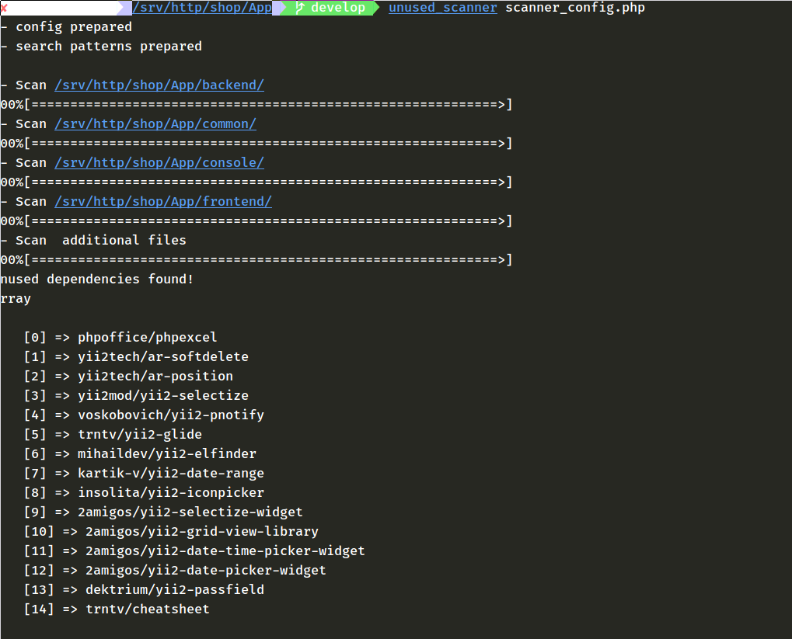

# Project scanner for detect unused composer dependencies

### Installation

`composer global require insolita/unused-scanner`

Ensure that your ~/.composer/vendor/bin directory declared in $PATH

`echo $PATH`

if not - you should add it in ~/.bashrc or ~/.profile

### Usage

prepare configuration file, see [scanner_config.example.php](scanner_config.example.php)

put it in project root (or other place)

run `composer dumpautoload` in your project directory

run `unused_scanner /path/to/configuration/file/scanner_config.php`

wait for result..

