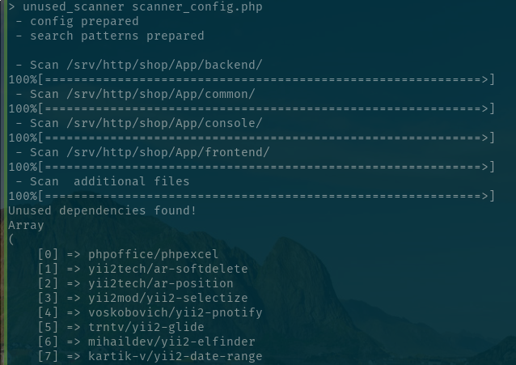

# Project scanner for detect unused composer dependencies

### Versions

Use 1.3.x@dev versions for projects with php 5.6, 7.0

Use 2.x versions for projects with php >= 7.1 

### ChangeLog

see [CHANGELOG.md](CHANGELOG.md)

### Installation

`composer global require insolita/unused-scanner`

Ensure that your ~/.composer/vendor/bin directory declared in $PATH

`echo $PATH`

if not - you should add it in ~/.bashrc or ~/.profile

### Update

`composer global update`

### Usage

prepare configuration file, see [scanner_config.example.php](scanner_config.example.php)

put it in project root (or other place)

run `composer dumpautoload` in your project directory

run `unused_scanner /path/to/configuration/file/scanner_config.php`

since 1.1 you can run it without  argument, if scanner_config.php existed in current working directory, it will be used
by default

**For auto-testing**:

Add --silent option for skip progress output and return exit code = 16, when unused packages detected

run `unused_scanner --silent /path/to/configuration/file/scanner_config.php`

**Docker**:

https://github.com/juanmrad/docker-unused-scanner

### Licence

This project uses the [MIT licence](https://choosealicense.com/licenses/mit/).
